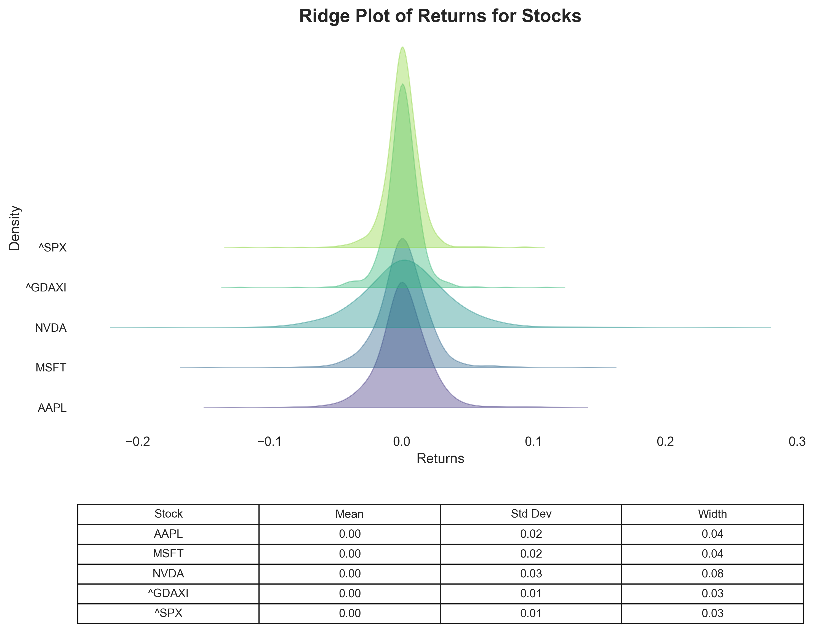

# Ridge Plot Generator

This project generates a **Ridge Plot** from a returns DataFrame stored in a pickle file. The plot visualizes KDE (Kernel Density Estimate) distributions of multiple stock returns, with statistics such as **mean**, **standard deviation**, and **distribution width** presented in a table below the plot.

---

## Ridgeplot of Return Distributions




## Installation

To set up the project, follow these steps:

1. **Create a Virtual Environment** using `uv`:
   ```bash
   uv venv .venv
   ```

2. **Activate the Virtual Environment**:
   - On Linux/macOS:
     ```bash
     source .venv/bin/activate
     ```
   - On Windows:
     ```bash
     .venv\Scripts\activate
     ```

3. **Install Required Packages**:
   Install the dependencies specified in `requirements.txt`:
   ```bash
   uv pip install -r requirements.txt
   ```

---

## Usage

### Creating Input Data

The script `create_input_cli.py` fetches historical stock data from Yahoo Finance, calculates daily returns, and saves the data in a pickle file for use in the Ridge Plot.

#### **Command-Line Arguments**

| Option         | Default Value         | Description                                      |
|----------------|-----------------------|--------------------------------------------------|
| `-s, --stocks` | **Required**          | Path to a text file containing stock symbols (one per line). |
| `-o, --output` | `input/returns.pkl`   | Path to save the output pickle file.             |

#### **Example**

1. Create a text file `stocks.txt` with stock symbols (one per line):
   ```
   AAPL
   MSFT
   NVDA
   ^SPX
   ```

2. Run the script:
   ```bash
   python create_input_cli.py -s stocks.txt
   ```
   - The output will be saved as `input/returns.pkl` by default.

3. Specify a custom output file:
   ```bash
   python create_input_cli.py -s stocks.txt -o custom_returns.pkl
   ```

---

### Generating Ridge Plot

The script `create_ridgeplot.py` generates a Ridge Plot and saves it as an image file. It takes the following arguments:

#### **Command-Line Arguments**

| Option         | Default Value                 | Description                                      |
|----------------|-------------------------------|--------------------------------------------------|
| `-i, --input`  | `./input/returns.pkl`         | Path to the input pickle file containing returns.|
| `-o, --output` | `./output`                    | Directory to save the output image file.         |
| `-n, --name`   | `YYYY-MM-DD_ridge_plot.png`   | Name of the output image file.                   |
| `-y, --y_spacing` | `0.5`                      | Vertical spacing between KDE curves.             |

---

#### **Running the Script**

1. **Default Usage**:
   Run the script with default options:
   ```bash
   python create_ridgeplot.py
   ```
   - Input: `./input/returns.pkl`
   - Output: `./output/YYYY-MM-DD_ridge_plot.png`

2. **Custom Input and Output Paths**:
   Specify the input file, output directory, and output file name:
   ```bash
   python create_ridgeplot.py -i ./data/returns.pkl -o ./results -n ridge_plot.png
   ```

3. **Adjust Vertical Spacing**:
   Use the `-y` argument to control the vertical spacing between curves:
   ```bash
   python create_ridgeplot.py -y 0.75
   ```

---

## Example Workflow

1. **Create Input Data**:
   ```bash
   python create_input_cli.py -s stocks.txt
   ```

2. **Generate Ridge Plot**:
   ```bash
   python create_ridgeplot.py
   ```

The resulting Ridge Plot will be saved to the `output` directory, with a table summarizing statistics for each stock.

---

## Dependencies

The project requires the following Python libraries:
- `pandas`
- `matplotlib`
- `seaborn`
- `numpy`
- `argparse`
- `yfinance`

Ensure they are installed via `requirements.txt`.

---
